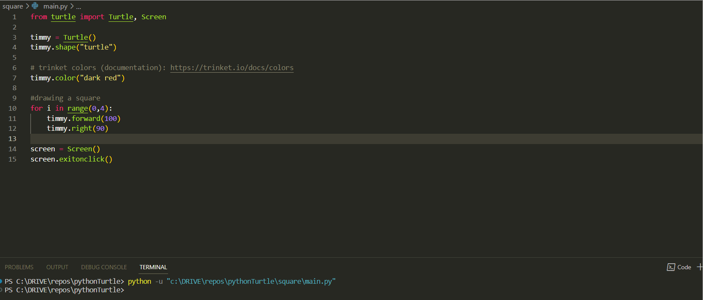
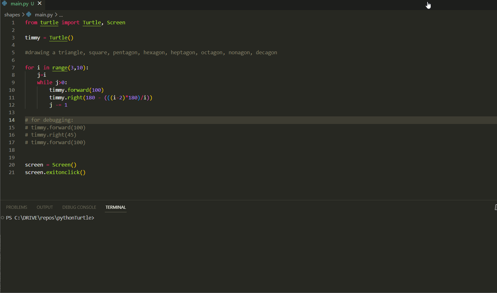
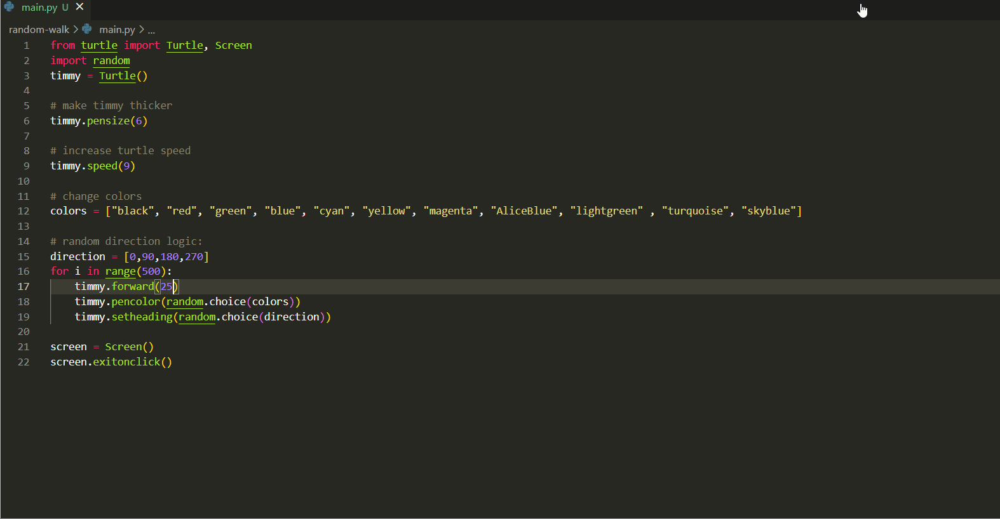

# Python Turtle Graphics Examples

This repository contains Python code exapmples for creating various shapes and designs using Python's Turtle graphics module.

## Installation

To use these examples, you will need to have Python 3 installed on your computer. You can download Python from the [official website](https://www.python.org/downloads/).

To run the code, you can use any text editor or integrated development environment (IDE) that supports Python. Some popular options include:

  1. [Visual Studio Code](https://code.visualstudio.com/)
  2. [Jetbrains Pycharm](https://www.jetbrains.com/pycharm/)
  
Choose the editor or IDE that you prefer and follow the instructions on their website to download and install it on your computer.

After installing the editor or IDE, you can clone this repository by running the following command in your terminal:

```
  git clone https://github.com/narayan9deep/pythonTurtle.git
```
    
## Usage

To run the examples, open the corresponding Python script in your editor or IDE and run it.

You can also modify the code to create your own designs and shapes. Make sure to save your changes before running the script.


## Screenshots

1. [Square:](./square/) 
<br>


2. [Dashed Line:](./dashed-line/)
<br>


3. [Shapes:](./shapes/)
<br>


4. [Random Walk:](./random-walk/)
<br>


5. [Spirograph](./spirograph/)
<br>


## Contributing

Contributions are always welcome!


## License

[MIT](https://choosealicense.com/licenses/mit/)


