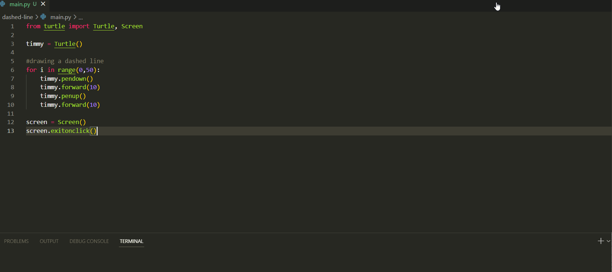

# Drawing a Dashed Line with Turtle Graphics in Python

This code uses the turtle graphics to draw a dashed line. A turtle object is created, and a loop is used to draw the dashed line by moving the turtle forward with its pen down and then up to create gaps.

## Video Demo:

GIF created with [LiceCap](http://www.cockos.com/licecap/).