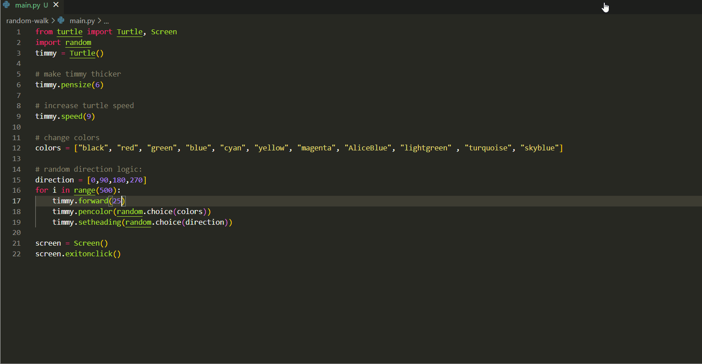

# Creating Random Lines with Turtle Graphics in Python

This code uses the turtle module to create a graphical interface where a turtle moves around the screen to create random lines in different colors.

## Video Demo

GIF created with [LiceCap](http://www.cockos.com/licecap/).