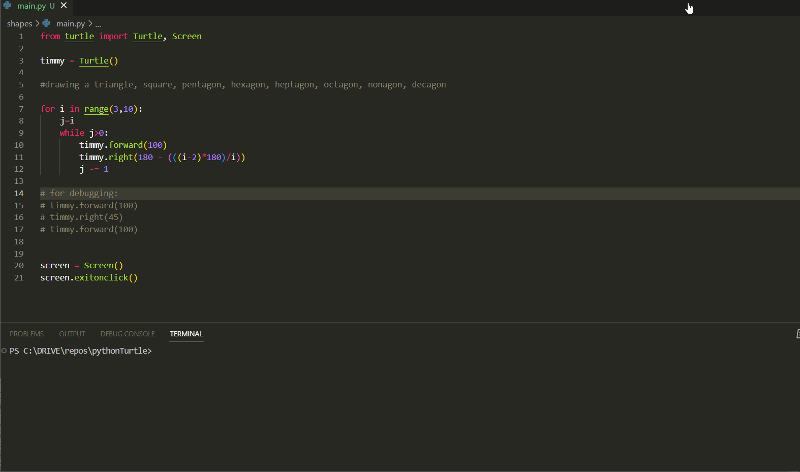

# Drawing Regular Polygons with Python Turtle Graphics Library

This code uses the Python Turtle graphics library to create a turtle and draw regular polygons with sides ranging from 3 to 10.

## Video Demo

GIF created with [LiceCap](http://www.cockos.com/licecap/).